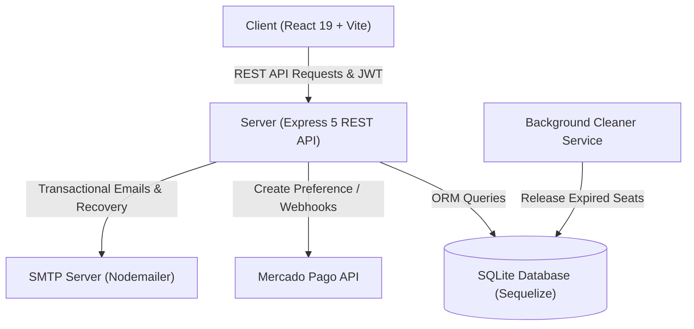
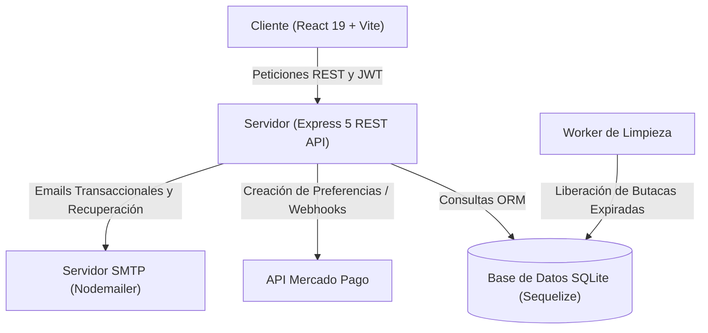

# 🎬 CineVerse - Full-Stack Cinema Ticketing & Management Platform

<div align="center">

[](https://react.dev/)
[](https://vitejs.dev/)
[](https://nodejs.org/)
[](https://expressjs.com/)
[](https://sequelize.org/)
[](https://www.sqlite.org/)
[](https://www.mercadopago.com/)
[](https://vitest.dev/)
[](https://getbootstrap.com/)

**A modern, end-to-end cinema ticketing, seat reservation, and candy bar management system with integrated payment gateway, role-based access control, and automated transactional emails.**

[English](#-english-version) • [Español](#-versión-en-español)

</div>

---

# 🌐 English Version

## 📌 Table of Contents
- [Project Overview](#-project-overview)
- [Key Features](#-key-features)
- [Tech Stack](#-tech-stack)
- [System Architecture](#-system-architecture)
- [Repository Structure](#-repository-structure)
- [Getting Started](#-getting-started)
  - [Prerequisites](#prerequisites)
  - [Installation](#installation)
  - [Environment Variables](#environment-variables)
  - [Database Seeding](#database-seeding)
  - [Running the Application](#running-the-application)
- [Testing Suite](#-testing-suite)
- [API Endpoints Overview](#-api-endpoints-overview)
- [Authors & Acknowledgments](#-authors--acknowledgments)

---

## 📖 Project Overview

**CineVerse** is a production-ready, full-stack web application designed to streamline the moviegoing and cinema administration experience. Built with a decoupled client-server architecture using **React 19**, **Node.js**, **Express 5**, and **Sequelize ORM**, CineVerse provides a responsive interface for customers to browse movie listings, pick specific theater seats in real time, purchase candy bar products, and complete checkout through **Mercado Pago**.

On the administrative side, it implements **Role-Based Access Control (RBAC)** across three tiers (`user`, `admin`, `sysadmin`) with dedicated panels for catalog maintenance, showtime scheduling, room layout management, and user privilege assignment.

---

## ✨ Key Features

### 🎟️ Customer & Booking Experience
- **Dynamic Movie Catalog & Billboard**: Hero carousel banners, rich movie cards with details (genre, runtime, synopsis, release date, rating, director).
- **Interactive Visual Seat Selector**: Real-time room grid layout with live seat status (available, reserved, selected) preventing collision bookings.
- **Candy Bar & Concession Store**: Interactive snack menu with dynamic pricing, stock tracking, and categorized listings.
- **Unified Shopping Cart**: Synchronized cart combining movie tickets, assigned seats, and candy bar snacks in a single transaction.
- **Secure Payment Gateway**: Complete integration with **Mercado Pago SDK**, handling payment preferences, redirect flow, and webhook callbacks.
- **Automated Transactional Emails**: Automated order confirmation emails with full purchase breakdown, tickets, and seat assignments powered by **Nodemailer (SMTP)**.
- **Customer Portal**: User profiles with purchase history, digital ticket receipts, and self-service password recovery workflows.

### 🛡️ Administration & RBAC Management
- **Tiered Permissions**:
  - **User**: Search, select seats, checkout, order candy, manage personal profile and orders.
  - **Admin**: Full CRUD operations for movies, screenings/schedules, screens, and candy bar products.
  - **SysAdmin**: Comprehensive system management, audit tools, and registration/privilege escalation for administrative personnel.
- **Background Seat Release Worker**: Automatic periodic cleaner that cancels expired pending checkout orders and releases locked seats back to the public pool.

---

## 🛠️ Tech Stack

### Frontend
- **Framework & Core**: [React 19](https://react.dev/), [Vite](https://vitejs.dev/)
- **Routing**: [React Router DOM v7](https://reactrouter.com/)
- **UI Components & Styling**: [React-Bootstrap](https://react-bootstrap.netlify.app/), [Bootstrap 5](https://getbootstrap.com/), custom CSS animations
- **Icons & Carousels**: [Lucide React](https://lucide.dev/), [Swiper](https://swiperjs.com/)
- **Notifications**: [React-Toastify](https://fkhadra.github.io/react-toastify/)
- **Testing**: [Vitest](https://vitest.dev/), [React Testing Library](https://testing-library.com/), [jsdom](https://github.com/jsdom/jsdom)

### Backend & Database
- **Runtime & Framework**: [Node.js](https://nodejs.org/) (ES Modules), [Express 5](https://expressjs.com/)
- **Database & ORM**: [SQLite3](https://www.sqlite.org/), [Sequelize ORM](https://sequelize.org/)
- **Security & Auth**: [JSON Web Tokens (JWT)](https://jwt.io/), [bcrypt](https://github.com/kelektiv/node.bcrypt.js)
- **Payments**: [Mercado Pago SDK v3](https://www.mercadopago.com/)
- **Mailing**: [Nodemailer](https://nodemailer.com/)
- **Testing**: [Vitest](https://vitest.dev/), [Supertest](https://github.com/ladjs/supertest)

---

## 🏗️ System Architecture



---

## 📁 Repository Structure

```text
TIF-CINEVERSE/
├── client/                      # Frontend Application (React + Vite)
│   ├── src/
│   │   ├── assets/              # Static assets, branding & images
│   │   ├── components/          # Reusable UI components
│   │   │   ├── CandyCard/       # Concession product cards
│   │   │   ├── CandyListings/   # Candy bar catalog layout
│   │   │   ├── Carousel/        # Featured movies carousel
│   │   │   ├── Cart/            # Checkout & cart components
│   │   │   ├── Forms/           # Admin creation/edit forms
│   │   │   ├── MovieCard/       # Movie billboard cards
│   │   │   ├── MovieListings/   # Movie grid & filtering
│   │   │   ├── ProtectedRoute/  # RBAC route guard component
│   │   │   ├── SeatSelector/    # Interactive seat picker grid
│   │   │   ├── SysAdminPanel/   # System administrator dashboard
│   │   │   ├── UserProfile/     # Profile & purchase history
│   │   │   ├── navBar/          # Navigation header & badges
│   │   │   └── pages/           # Application views/routes
│   │   ├── context/             # Global Auth & Cart Context providers
│   │   ├── services/            # API client wrapper (`apiRequest`)
│   │   ├── tests/               # Test configuration & setup
│   │   └── utils/               # Helper functions
│   ├── package.json
│   └── vite.config.js
│
├── server/                      # Backend API (Node.js + Express)
│   ├── config/                  # Configuration helpers
│   ├── src/
│   │   ├── models/              # Sequelize schemas (Movie, Screen, Seat, Order, etc.)
│   │   ├── routes/              # Express API route declarations & route unit tests
│   │   ├── services/            # Business logic, mailer, payments, order services
│   │   ├── tests/               # Backend test suites & mocks
│   │   ├── config.js            # Environment variable configuration
│   │   ├── db.js                # Database connection & Sequelize instance
│   │   ├── index.js             # Server entry point & middleware pipeline
│   │   └── seed.js              # Database initialization & mock data seeder
│   ├── .env.example             # Template for backend environment variables
│   └── package.json
└── README.md
```

---

## 🚀 Getting Started

### Prerequisites
- **Node.js** `>= 18.x`
- **npm** `>= 9.x`

### Installation

1. **Clone the repository**:
   ```bash
   git clone https://github.com/your-username/TIF-CINEVERSE.git
   cd TIF-CINEVERSE
   ```

2. **Install Server Dependencies**:
   ```bash
   cd server
   npm install
   ```

3. **Install Client Dependencies**:
   ```bash
   cd ../client
   npm install
   ```

---

### ⚙️ Environment Variables

Create a `.env` file in the `server/` directory based on `server/.env.example`:

```bash
cd server
cp .env.example .env
```

Configure the following variables in `server/.env`:

| Variable | Description | Default / Example |
| :--- | :--- | :--- |
| `PORT` | Server listener port | `3000` |
| `JWT_SECRET` | Secret key for signing JSON Web Tokens | `your_secure_random_jwt_secret` |
| `DB_PATH` | SQLite database file location | `movies.db` |
| `EMAIL_HOST` | SMTP server host | `smtp.gmail.com` |
| `EMAIL_PORT` | SMTP port | `587` |
| `EMAIL_USER` | SMTP username / email address | `your_email@gmail.com` |
| `EMAIL_PASS` | SMTP application password | `your_app_password` |
| `EMAIL_FROM` | Sender address for outgoing emails | `"CineVerse" <noreply@cineverse.com>` |
| `MP_ACCESS_TOKEN`| Mercado Pago Access Token (Sandbox/Prod) | `TEST-XXXX...` |
| `MP_PUBLIC_KEY` | Mercado Pago Public Key | `TEST-XXXX...` |
| `MP_WEBHOOK_URL` | Webhook URL for payment notifications | `http://localhost:3000/api/payments/webhook` |
| `FRONTEND_URL` | Allowed client origin for CORS | `http://localhost:5173` |

*(Optional)* In the `client/` directory, you can specify `VITE_API_URL` in a `.env` file if connecting to an external backend:
```env
VITE_API_URL=http://localhost:3000/api
```

---

### 🗄️ Database Seeding

Populate the SQLite database with initial movies, screens, showtimes, seats, and candy bar products:

```bash
cd server
npm run seed
```

---

### 💻 Running the Application

1. **Start Backend API Server**:
   ```bash
   cd server
   npm run dev
   ```
   *The server will run on `http://localhost:3000` with hot-reloading enabled.*

2. **Start Frontend Development Server**:
   ```bash
   cd client
   npm run dev
   ```
   *The client interface will be available at `http://localhost:5173`.*

---

## 🧪 Testing Suite

The repository includes a comprehensive unit and integration testing suite for both frontend and backend using **Vitest**:

### Run Frontend Tests
```bash
cd client
npm test
```
*Tests cover components, authentication routing, shopping cart operations, seat selector interactivity, and admin panels.*

### Run Backend Tests
```bash
cd server
npm test
```
*Tests validate API endpoints, services, authentication tokens, order creation, payment workflows, and business logic with Supertest.*

---

## 📡 API Endpoints Overview

| Method | Endpoint | Description | Access |
| :--- | :--- | :--- | :--- |
| `POST` | `/api/auth/register` | Register a new user | Public |
| `POST` | `/api/auth/login` | Authenticate and obtain JWT | Public |
| `POST` | `/api/auth/forgot-password` | Request password reset email | Public |
| `POST` | `/api/auth/reset-password/:token` | Reset password using valid token | Public |
| `GET` | `/api/movies` | Fetch all movies | Public |
| `POST` | `/api/movies` | Create a new movie | Admin / SysAdmin |
| `GET` | `/api/movieshowings` | List movie showtimes | Public |
| `POST` | `/api/movieshowings` | Schedule a new showtime | Admin / SysAdmin |
| `GET` | `/api/seats/showing/:id` | Get seat availability map for a showing | Public |
| `GET` | `/api/products` | Retrieve candy bar inventory | Public |
| `POST` | `/api/products` | Add new candy bar product | Admin / SysAdmin |
| `POST` | `/api/orders` | Create an order with reserved seats | Authenticated |
| `POST` | `/api/payments/create-preference` | Generate Mercado Pago payment preference | Authenticated |
| `POST` | `/api/payments/webhook` | Process asynchronous payment callback | Public (MP Gateway) |
| `GET` | `/api/users/profile` | Get current user profile & purchase history | Authenticated |

---

## 👥 Authors & Acknowledgments

Developed with dedication as a collaborative final integrative project (**TIF**):

- **Darek Smolarz**
- **Giuliano Di Stasi**
- **Joaquín Sánchez**

---

<br/>

---

# 🇪🇸 Versión en Español

## 📌 Tabla de Contenidos
- [Descripción del Proyecto](#-descripción-del-proyecto)
- [Características Principales](#-características-principales)
- [Tecnologías Utilizadas](#-tecnologías-utilizadas)
- [Arquitectura del Sistema](#-arquitectura-del-sistema)
- [Estructura del Repositorio](#-estructura-del-repositorio)
- [Instalación y Puesta en Marcha](#-instalación-y-puesta-en-marcha)
  - [Requisitos Previos](#requisitos-previos)
  - [Instalación](#instalación-1)
  - [Variables de Entorno](#variables-de-entorno)
  - [Poblado de Base de Datos](#poblado-de-base-de-datos-seeding)
  - [Ejecución](#ejecución-de-la-aplicación)
- [Suite de Pruebas](#-suite-de-pruebas-testing)
- [Resumen de Endpoints de la API](#-resumen-de-endpoints-de-la-api)
- [Autores y Colaboradores](#-autores-y-colaboradores)

---

## 📖 Descripción del Proyecto

**CineVerse** es una plataforma web integral full-stack desarrollada para modernizar y facilitar tanto la compra de entradas y combos de cine por parte de los clientes como la administración operativa de las salas de cine. Basada en una arquitectura desacoplada cliente-servidor construida con **React 19**, **Node.js**, **Express 5** y **Sequelize ORM**, la aplicación brinda una experiencia fluida, rápida y completamente responsive.

A nivel de gestión, implementa **Control de Acceso Basado en Roles (RBAC)** con tres niveles (`user`, `admin`, `sysadmin`), proveyendo paneles de administración dedicados para la carga de películas, funciones, gestión de stock del Candy Bar y control de usuarios.

---

## ✨ Características Principales

### 🎟️ Experiencia de Usuario y Reservas
- **Cartelera Dinámica**: Visualización en carrusel de películas destacadas, fichas técnicas completas (género, duración, sinopsis, fecha de estreno, calificación y director).
- **Selector Interactivo de Butacas**: Mapeo visual e interactivo de las salas de cine en tiempo real con estado de cada asiento (disponible, ocupado, seleccionado), previniendo reservas duplicadas.
- **Tienda Candy Bar**: Catálogo de productos de confitería (pochoclos, nachos, bebidas, golosinas) con control de stock y cálculo de precios en tiempo real.
- **Carrito de Compras Unificado**: Carrito sincronizado que agrupa entradas de funciones, butacas seleccionadas y productos del Candy Bar en un único checkout.
- **Pasarela de Pagos Segura**: Integración completa con **Mercado Pago**, manejando la generación de preferencias de pago, redirección segura y webhooks para actualización automática del estado de las órdenes.
- **Correos Transaccionales Automáticos**: Envío de confirmaciones de compra, comprobantes detallados y entradas digitales mediante **Nodemailer (SMTP)**.
- **Perfil de Usuario**: Historial de compras con acceso a comprobantes digitales y flujo de recuperación de contraseña por token seguro.

### 🛡️ Administración y Roles (RBAC)
- **Permisos Jerárquicos**:
  - **User**: Búsqueda de cartelera, selección de asientos, compras en Candy Bar, gestión de perfil e historial de compras.
  - **Admin**: Operaciones CRUD para películas, funciones/horarios, salas y productos del Candy Bar.
  - **SysAdmin**: Control total del sistema, auditoría y asignación/creación de nuevos administradores y sysadmins.
- **Limpieza Automática de Órdenes Expiradas**: Proceso en segundo plano que libera periódicamente las butacas bloqueadas si la orden de pago caduca o no es completada.

---

## 🛠️ Tecnologías Utilizadas

### Frontend
- **Framework y Núcleo**: [React 19](https://react.dev/), [Vite](https://vitejs.dev/)
- **Enrutamiento**: [React Router DOM v7](https://reactrouter.com/)
- **Estilos y Componentes UI**: [React-Bootstrap](https://react-bootstrap.netlify.app/), [Bootstrap 5](https://getbootstrap.com/), CSS personalizado
- **Iconografía y Carruseles**: [Lucide React](https://lucide.dev/), [Swiper](https://swiperjs.com/)
- **Notificaciones**: [React-Toastify](https://fkhadra.github.io/react-toastify/)
- **Testing**: [Vitest](https://vitest.dev/), [React Testing Library](https://testing-library.com/), [jsdom](https://github.com/jsdom/jsdom)

### Backend y Base de Datos
- **Entorno y Framework**: [Node.js](https://nodejs.org/) (ES Modules), [Express 5](https://expressjs.com/)
- **Base de Datos y ORM**: [SQLite3](https://www.sqlite.org/), [Sequelize ORM](https://sequelize.org/)
- **Seguridad y Autenticación**: [JSON Web Tokens (JWT)](https://jwt.io/), [bcrypt](https://github.com/kelektiv/node.bcrypt.js)
- **Pasarela de Pagos**: [Mercado Pago SDK v3](https://www.mercadopago.com/)
- **Servicio de Email**: [Nodemailer](https://nodemailer.com/)
- **Testing**: [Vitest](https://vitest.dev/), [Supertest](https://github.com/ladjs/supertest)

---

## 🏗️ Arquitectura del Sistema



---

## 📁 Estructura del Repositorio

```text
TIF-CINEVERSE/
├── client/                      # Aplicación Frontend (React + Vite)
│   ├── src/
│   │   ├── assets/              # Recursos estáticos, imágenes y logotipos
│   │   ├── components/          # Componentes reutilizables de UI
│   │   │   ├── CandyCard/       # Tarjetas de productos del Candy Bar
│   │   │   ├── CandyListings/   # Listado y catálogo de confitería
│   │   │   ├── Carousel/        # Carrusel de películas destacadas
│   │   │   ├── Cart/            # Componentes de carrito y checkout
│   │   │   ├── Forms/           # Formularios de creación y edición (Admin)
│   │   │   ├── MovieCard/       # Tarjetas individuales de películas
│   │   │   ├── MovieListings/   # Grilla y filtros de cartelera
│   │   │   ├── ProtectedRoute/  # Guardia de rutas protegidas por rol
│   │   │   ├── SeatSelector/    # Grilla interactiva de selección de butacas
│   │   │   ├── SysAdminPanel/   # Panel de control de administradores
│   │   │   ├── UserProfile/     # Perfil de usuario e historial de compras
│   │   │   ├── navBar/          # Barra de navegación principal
│   │   │   └── pages/           # Vistas y páginas principales
│   │   ├── context/             # Contextos globales (AuthContext, CartContext)
│   │   ├── services/            # Cliente HTTP centralizado (`apiRequest`)
│   │   ├── tests/               # Configuración del entorno de pruebas
│   │   └── utils/               # Utilidades y funciones auxiliares
│   ├── package.json
│   └── vite.config.js
│
├── server/                      # Backend API (Node.js + Express)
│   ├── config/                  # Helpers de configuración
│   ├── src/
│   │   ├── models/              # Modelos Sequelize (Movie, Screen, Seat, Order, etc.)
│   │   ├── routes/              # Definición de rutas y tests de integración
│   │   ├── services/            # Lógica de negocio, correo, pagos y órdenes
│   │   ├── tests/               # Suites de pruebas del backend
│   │   ├── config.js            # Configuración de variables de entorno
│   │   ├── db.js                # Instancia de Sequelize y conexión SQLite
│   │   ├── index.js             # Entrada del servidor y middlewares
│   │   └── seed.js              # Script de inicialización y datos de prueba
│   ├── .env.example             # Plantilla de variables de entorno
│   └── package.json
└── README.md
```

---

## 🚀 Instalación y Puesta en Marcha

### Requisitos Previos
- **Node.js** `>= 18.x`
- **npm** `>= 9.x`

### Instalación

1. **Clonar el repositorio**:
   ```bash
   git clone https://github.com/tu-usuario/TIF-CINEVERSE.git
   cd TIF-CINEVERSE
   ```

2. **Instalar Dependencias del Backend**:
   ```bash
   cd server
   npm install
   ```

3. **Instalar Dependencias del Frontend**:
   ```bash
   cd ../client
   npm install
   ```

---

### ⚙️ Variables de Entorno

Crear el archivo `.env` dentro de la carpeta `server/` basándose en `server/.env.example`:

```bash
cd server
cp .env.example .env
```

Completar los siguientes valores en `server/.env`:

| Variable | Descripción | Ejemplo / Valor por defecto |
| :--- | :--- | :--- |
| `PORT` | Puerto de escucha del servidor backend | `3000` |
| `JWT_SECRET` | Clave secreta para firmar tokens JWT | `tu_clave_secreta_jwt_aqui` |
| `DB_PATH` | Ruta del archivo de base de datos SQLite | `movies.db` |
| `EMAIL_HOST` | Host del servidor SMTP para envíos de correo | `smtp.gmail.com` |
| `EMAIL_PORT` | Puerto del servidor SMTP | `587` |
| `EMAIL_USER` | Usuario o cuenta de correo electrónico | `tu_correo@gmail.com` |
| `EMAIL_PASS` | Contraseña de aplicación generada para SMTP | `tu_contraseña_de_aplicacion` |
| `EMAIL_FROM` | Remitente visible en los correos enviados | `"CineVerse" <noreply@cineverse.com>` |
| `MP_ACCESS_TOKEN`| Access Token de Mercado Pago (Sandbox / Producción) | `TEST-XXXX...` |
| `MP_PUBLIC_KEY` | Public Key de Mercado Pago | `TEST-XXXX...` |
| `MP_WEBHOOK_URL` | URL del Webhook para notificaciones de pago | `http://localhost:3000/api/payments/webhook` |
| `FRONTEND_URL` | Origen permitido para CORS en el cliente | `http://localhost:5173` |

*(Opcional)* En el directorio `client/`, puedes definir `VITE_API_URL` en un archivo `.env` si necesitas apuntar a un servidor remoto:
```env
VITE_API_URL=http://localhost:3000/api
```

---

### 🗄️ Poblado de Base de Datos (Seeding)

Para cargar películas de muestra, salas, funciones programadas, grillas de butacas y productos de confitería:

```bash
cd server
npm run seed
```

---

### 💻 Ejecución de la Aplicación

1. **Iniciar el Servidor Backend**:
   ```bash
   cd server
   npm run dev
   ```
   *El servidor iniciará en `http://localhost:3000` con reinicio automático ante cambios.*

2. **Iniciar el Servidor Frontend**:
   ```bash
   cd client
   npm run dev
   ```
   *La aplicación web estará disponible en `http://localhost:5173`.*

---

## 🧪 Suite de Pruebas (Testing)

El proyecto cuenta con cobertura de pruebas unitarias y de integración en ambas capas mediante **Vitest**:

### Ejecutar Pruebas del Frontend
```bash
cd client
npm test
```
*Verifica componentes visuales, selectores de butacas, guardias de rutas protegidas, formularios y flujos de carrito de compras.*

### Ejecutar Pruebas del Backend
```bash
cd server
npm test
```
*Evalúa controladores, endpoints de la API, servicios de autenticación, transacciones de pago y lógica de negocio con Supertest.*

---

## 📡 Resumen de Endpoints de la API

| Método | Endpoint | Descripción | Nivel de Acceso |
| :--- | :--- | :--- | :--- |
| `POST` | `/api/auth/register` | Registro de nuevos usuarios | Público |
| `POST` | `/api/auth/login` | Autenticación y generación de JWT | Público |
| `POST` | `/api/auth/forgot-password` | Solicitud de restablecimiento de contraseña | Público |
| `POST` | `/api/auth/reset-password/:token` | Restablecimiento de contraseña por token | Público |
| `GET` | `/api/movies` | Listado general de películas en cartelera | Público |
| `POST` | `/api/movies` | Carga de una nueva película | Admin / SysAdmin |
| `GET` | `/api/movieshowings` | Listado de funciones y horarios | Público |
| `POST` | `/api/movieshowings` | Programación de una nueva función | Admin / SysAdmin |
| `GET` | `/api/seats/showing/:id` | Estado y disponibilidad de asientos por función | Público |
| `GET` | `/api/products` | Catálogo de productos del Candy Bar | Público |
| `POST` | `/api/products` | Creación de productos para el Candy Bar | Admin / SysAdmin |
| `POST` | `/api/orders` | Creación de orden con reserva de butacas | Autenticado |
| `POST` | `/api/payments/create-preference` | Creación de preferencia de pago en Mercado Pago | Autenticado |
| `POST` | `/api/payments/webhook` | Recepción de notificaciones de pago | Público (Pasarela MP) |
| `GET` | `/api/users/profile` | Perfil del usuario autenticado e historial | Autenticado |

---

## 👥 Autores y Colaboradores

Proyecto desarrollado como Trabajo Integrador Final (**TIF**):

- **Darek Smolarz**
- **Giuliano Di Stasi**
- **Joaquín Sánchez**